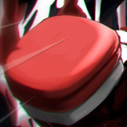
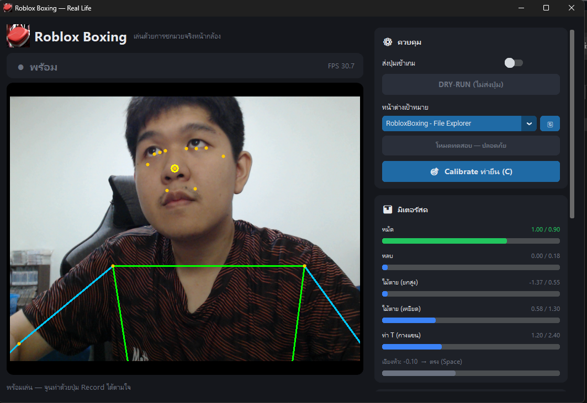

<div align="center">



# Roblox Boxing — Real Life 🥊

**เล่น Untitled Boxing Game ด้วยการชกมวยจริงผ่านเว็บแคม**
แย็บ · ฮุค · การ์ด · หลบ (ซ้าย/ขวา) · ไม้ตาย · สกิล — จับจากร่างกายจริง ไม่ต้องแตะคีย์บอร์ด

[](../../releases/latest)
[](../../releases/latest)
[](../../releases)
[](LICENSE)
[](https://developers.google.com/mediapipe)

<a href="https://github.com/pondlnwtrue007/roblox-boxing-reallife/releases/latest/download/RobloxBoxing-win64.zip">
  
</a>

<sub>คลิกปุ่มด้านบนโหลด `RobloxBoxing-win64.zip` (~140MB) → แตกไฟล์ → ดับเบิลคลิก `RobloxBoxing.exe`</sub>

<sub>🎨 FAN-MADE · แจกฟรี · ไม่เกี่ยวข้องกับ Roblox Corporation — ดู [LICENSE](LICENSE)</sub>

</div>

---

## 🎬 หน้าตาแอป

<div align="center">

</div>

> เลือกหน้าต่างเกม → **Calibrate ท่ายืน** → **จูนท่าด้วย Record** → เปิดสวิตช์ **LIVE** → ชกหน้ากล้อง!
> มี **skeleton** ลากตามตัว + **มิเตอร์สด** บอกทุกท่าว่าจับได้จริง (เขียว = ท่าจะติด)

---

## 🥊 ท่า → ปุ่ม

| ท่าทางจริง | ตรวจจับจาก | ปุ่มที่ส่ง |
|-----------|-----------|-----------|
| 🥊 แย็บซ้าย | แขนซ้ายเหยียดออก | `K` |
| 🥊 ฮุคขวา | แขนขวาเหยียดออก | `L` |
| 🛡️ ตั้งการ์ด | ข้อมือสองข้างระดับหน้า ชิดกัน | `F` (ค้าง) |
| 💨 หลบ (พุ่งหน้า) | ย่อตัว หัวตรง | `Space` |
| ↔️ หลบซ้าย / ขวา | ย่อ + เอียงหัวซ้าย/ขวา | `Space`+`A` / `Space`+`D` |
| 💥 ไม้ตาย | ยกแขนสองข้างขึ้นเหนือหัว | `Q` |
| ✨ สกิล (ท่า T) | กางแขนสองข้างระดับไหล่ | `R` |

---

## ⬇️ โหลดแล้วเล่นเลย (สำหรับคนทั่วไป)

1. คลิก **[⬇️ ดาวน์โหลด RobloxBoxing-win64.zip](https://github.com/pondlnwtrue007/roblox-boxing-reallife/releases/latest/download/RobloxBoxing-win64.zip)** (~140MB) — หรือดูทุกเวอร์ชันที่ [Releases](../../releases)
2. **แตกไฟล์ (Extract All)** แล้วเข้าโฟลเดอร์ → ดับเบิลคลิก **`RobloxBoxing.exe`**
   - ถ้า SmartScreen เตือน "Windows protected your PC" → กด **More info → Run anyway**
     (เพราะ .exe ยังไม่ได้เซ็นดิจิทัล เป็นเรื่องปกติของโปรแกรมทำเอง)
   - ครั้งแรกเปิดช้า ~10-20 วิ (โหลดโมเดล AI) ครั้งต่อไปเร็วขึ้น
3. ทำตามขั้นตอนในหัวข้อ **[🎮 วิธีเล่นละเอียด](#-วิธีเล่นละเอียด-ทีละขั้น)** ด้านล่าง

> 💻 ต้องใช้ **Windows 10/11** + **เว็บแคม** และเปิด **Roblox (Untitled Boxing Game)** ไว้
> ⌨️ ตั้ง keybind ในเกมให้ตรง: Light `K` · Heavy `L` · Block `F` · Dash `Space` · Ultimate `Q` · Ability `R`

---

## 🎮 วิธีเล่นละเอียด (ทีละขั้น)

### ① เลือกหน้าต่างเป้าหมาย
ในการ์ด **ควบคุม** (ขวาบน) → ช่อง **"หน้าต่างเป้าหมาย"** เลือก **Roblox**
(กด 🔄 ถ้าเพิ่งเปิดเกม ยังไม่เห็นในลิสต์) — ระบบจะส่งปุ่มเฉพาะตอนหน้าต่าง Roblox โฟกัสอยู่
เท่านั้น กันปุ่มรั่วไป OBS/เบราว์เซอร์

### ② Calibrate ท่ายืน
กดปุ่ม **🎯 Calibrate ท่ายืน (C)** → **ยืนนิ่งในท่าปกติ ~2 วิ** ให้เห็นตัวเต็มในกล้อง
(ระบบใช้ความสูงลำตัวตอนนี้เป็น "ฐาน" สำหรับตัดสินว่า "หลบ" คือย่อต่ำกว่านี้)

### ③ จูนท่าด้วย Record (สำคัญ! ทำให้จับท่าแม่น)
แทนการเดาค่า ให้ **กดปุ่ม Record แล้วทำท่านั้นจริงๆ ~3 วิ** ระบบจับ "ช่วงค่าจริง" ของ
ร่างกายคุณแล้วตั้งค่าให้เอง (เซฟจำไว้ในไฟล์ ทำครั้งเดียวพอ):

| ปุ่ม / คีย์ | ทำท่าตามที่จอบอก |
|:---:|---|
| **หมัด** `1` | ชกซ้าย/ขวาสลับกัน สุดแรง |
| **หลบ** `2` | ย่อตัวลง-ขึ้นซ้ำๆ (ต่ำสุดเท่าที่จะหลบจริง) |
| **ไม้ตาย** `3` | ยกแขนสองข้างขึ้นสูงสุด ค้างไว้ |
| **การ์ด** `4` | ตั้งการ์ดค้างไว้ |
| **ท่า T** `5` | กางแขนสองข้างออกด้านข้าง ค้างไว้ |

> ดู **มิเตอร์สด** ประกอบ: แถบจะ **เขียว** เมื่อค่าปัจจุบันเกินเส้น (= ท่าจะติด),
> **น้ำเงิน** = ยังไม่ถึง เห็นทันทีว่าทำไมท่าไม่ติด แล้ว Record ใหม่ได้เรื่อยๆ

### ④ ทดสอบก่อน (โหมด DRY-RUN)
ตอนนี้สวิตช์ **"ส่งปุ่มเข้าเกม" ยังปิด** (DRY-RUN — ปลอดภัย ไม่ส่งปุ่มจริง)
ลองทำ 5 ท่าดูว่าป้ายท่าด้านบน + มิเตอร์เปลี่ยนถูกต้องไหม

### ⑤ เล่นจริง (LIVE)
1. เปิด Roblox เข้าเกมให้พร้อม
2. **เปิดสวิตช์ "ส่งปุ่มเข้าเกม"** → เปลี่ยนเป็น **🔴 LIVE**
3. **คลิกไปที่หน้าต่าง Roblox ให้โฟกัส** → ป้ายจะขึ้น **🟢 ส่งเข้าเกมได้** → ชกได้เลย!
   - ถ้าขึ้น **🟠 ยังไม่โฟกัส** = ปุ่มยังไม่ส่ง (คลิกที่เกมก่อน)
   - วางหน้าต่างแอปไว้จอที่ 2 หรือมุมจอ จะได้เห็น skeleton + มิเตอร์ระหว่างเล่น

> 💡 **อยากเช็คว่าปุ่มออกจริงไหม?** เลือก "(ทุกหน้าต่าง)" ในช่องหน้าต่างเป้าหมาย → เปิด
> Notepad โฟกัสไว้ → เปิด LIVE → ทำท่า จะเห็นตัวอักษร `k` `l` `f` พิมพ์ลง Notepad

### 🥋 หลบมีทิศ (สลิปแบบมวย)
ตอนย่อหลบ **เอียงหัว** ไปทางที่จะหลบ: หัวตรง → `Space` · เอียงซ้าย → `Space`+`A` ·
เอียงขวา → `Space`+`D` (ดูค่า **LEAN** สดในแอป)

---

## ⌨️ ปุ่มลัด

| ปุ่ม | ทำอะไร | | ปุ่ม | ทำอะไร |
|:---:|---|---|:---:|---|
| `C` | calibrate ท่ายืน | | `1`–`5` | record ท่า |
| `T` | สลับ DRY ↔ LIVE | | `0` | คืนค่า default |
| `W` | รีเฟรชรายชื่อหน้าต่าง | | `S` | เซฟค่าจูน |
| `[` `]` | ปรับหมัดง่าย/ยาก | | `;` `'` | ปรับหลบง่าย/ยาก |
| `Esc` | ออก | | | (ไม่ใช้ `Q` — เป็นไม้ตายในเกม) |

---

## 🖥️ รันจาก source (สำหรับคนมี Python)

ต้องมี **Python 3.10+** บน Windows

```bash
pip install -r requirements.txt
python app.py          # แอป GUI (แนะนำ)
# python main.py       # รุ่นเบา หน้าต่าง OpenCV ล้วน
```

ค่าจูนเก็บที่ `%LOCALAPPDATA%\RobloxBoxingReallife\boxing_settings.json` (ลบ = คืนค่า default)

---

## 🛠️ จูนละเอียด (`config.py`)

ค่าทั้งหมดอยู่ด้านบนไฟล์ มีคอมเมนต์ครบ หน่วยเป็น "สัดส่วนของความยาวลำตัว"
(ใช้ได้เหมือนกันไม่ว่าตัวใหญ่/เล็ก กล้องใกล้/ไกล) จุดที่มักปรับ:

- **หมัดยิงรัวไป** → เพิ่ม `PUNCH_COOLDOWN_SEC`
- **แย็บ/ฮุคสลับข้าง** (ภาพกระจก) → `SWAP_LEFT_RIGHT = True`
- **หลบซ้าย/ขวาสลับข้าง** → `DODGE_SWAP_LR = True`

> **มุมกล้อง:** หมัดพุ่งตรงเข้ากล้องตรวจยากใน 2D — ยืน **เฉียงกล้องนิดหน่อย** หรือชกออกด้านข้าง
> เล็กน้อยจะจับได้ชัดกว่า

---

## 🗂️ โครงสร้างไฟล์

| ไฟล์ | หน้าที่ |
|------|---------|
| **`app.py`** | แอป GUI (CustomTkinter) — ตัวหลัก |
| `main.py` | รุ่นเบา หน้าต่าง OpenCV + ปุ่มลัด |
| `config.py` | ค่าตั้งค่า/threshold ทั้งหมด |
| `pose_detector.py` | หุ้ม MediaPipe Pose → landmark + เมตริกท่าชกมวย |
| `motion_logic.py` | สมอง — ตัดสินท่า (priority + cooldown + hysteresis + record) |
| `input_sender.py` | ส่งปุ่มผ่าน pydirectinput (tap / hold / combo) |
| `settings_store.py` | เซฟ/โหลดค่าจูนลง JSON |
| `window_picker.py` | dropdown เลือกหน้าต่าง (สำหรับ `main.py`) |
| `camera.py` | กล้องแบบ threaded (ลด latency) |
| `winfocus.py` | เช็ก/ลิสต์หน้าต่าง active (กันปุ่มรั่ว) |
| `paths.py` | จัดการ path (รองรับ build `.exe`) |

---

## 🧠 ทำงานยังไง (ย่อ)

```
เว็บแคม → MediaPipe Pose → เมตริก (normalize ด้วยความยาวลำตัว)
        → ตัดสินท่า (priority: ไม้ตาย > ท่า T > การ์ด > หลบ > หมัด)
        → pydirectinput ส่ง scancode เข้า Roblox (เฉพาะตอนเกมโฟกัส)
```

---

## 🗺️ Roadmap

- [ ] ถอยหลัง: ย่อ + เอนตัวไปหลัง → `Space`+`S`
- [ ] คอมโบ/ท่าต่อเนื่อง

---

## 📄 License

[MIT](LICENSE) © 2026 · แก้ชื่อเจ้าของลิขสิทธิ์ในไฟล์ `LICENSE` ได้ตามต้องการ

<div align="center"><sub>🥊 ต่อยอดโครงสร้างจากโปรเจกต์ <a href="https://github.com/pondlnwtrue007/cookie-run-reallife">Cookie Run Real-Life</a></sub></div>
